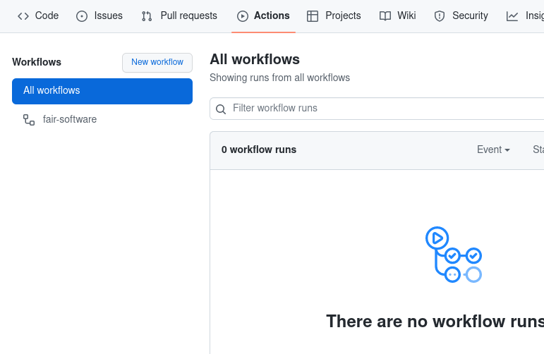
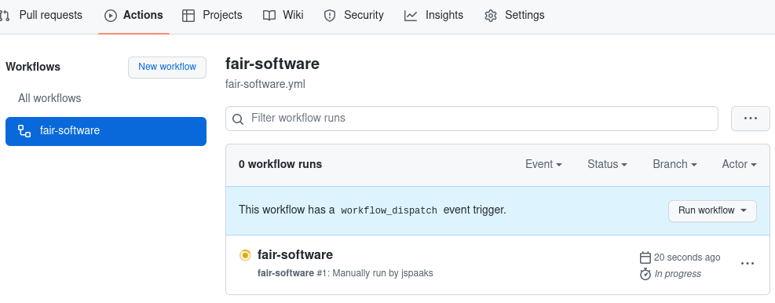
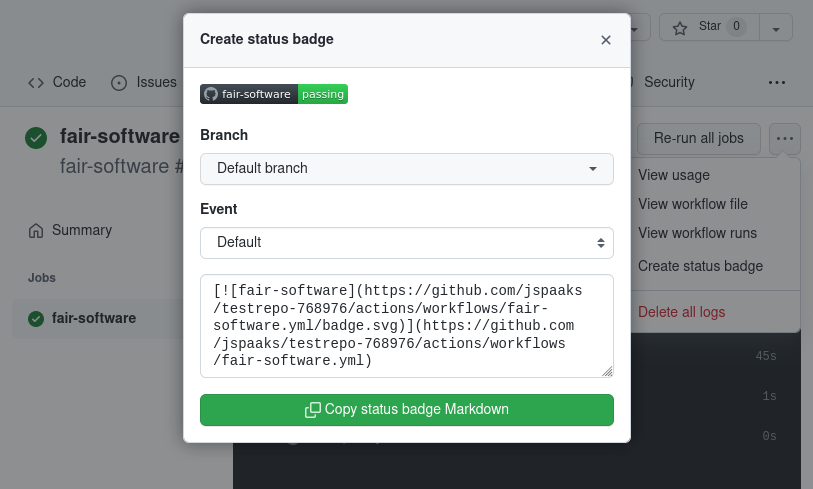
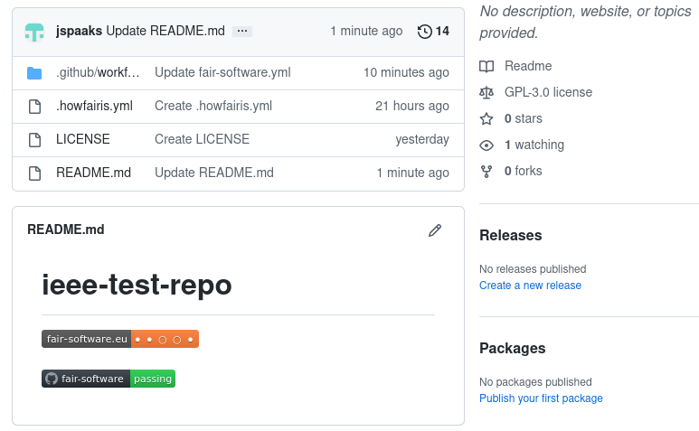
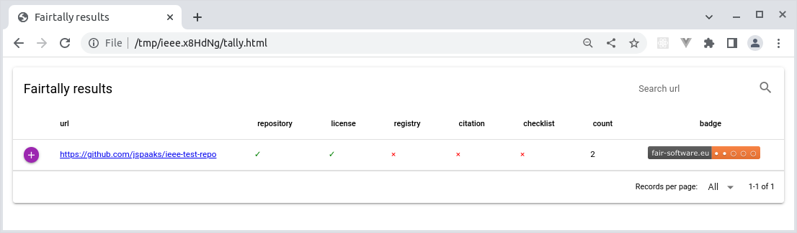
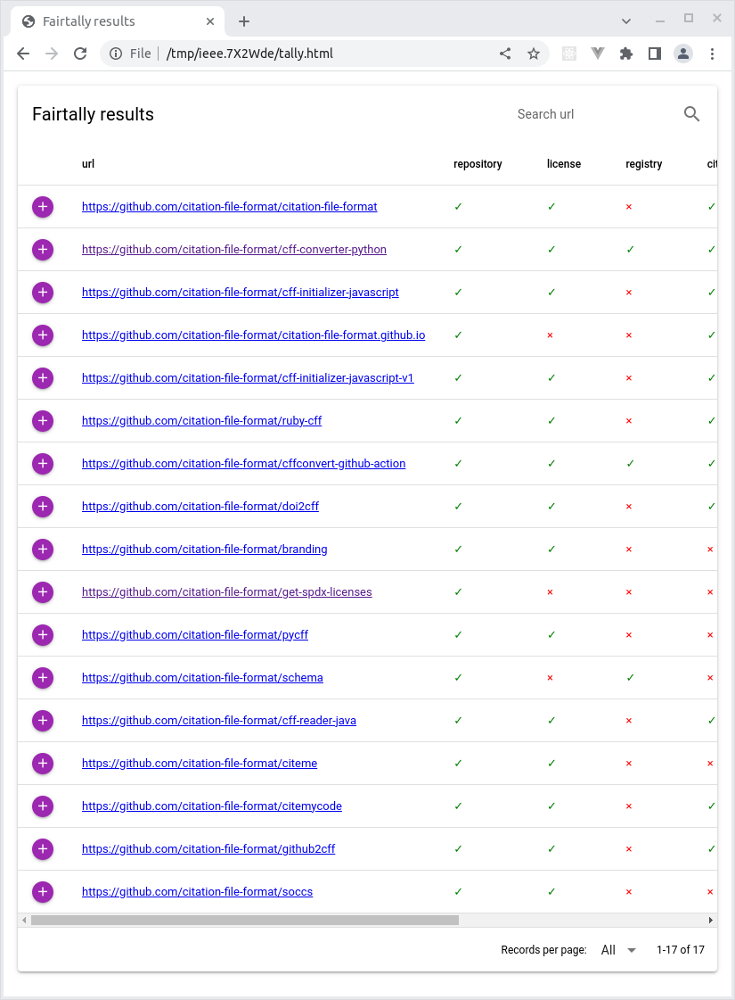
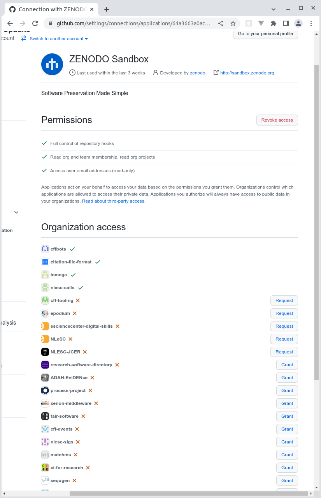
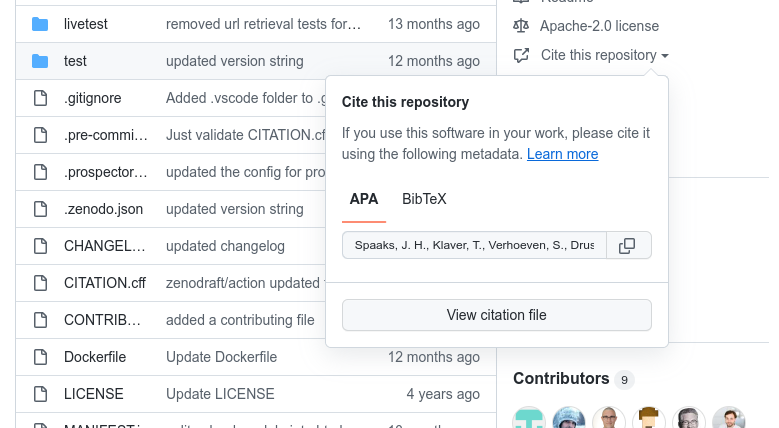
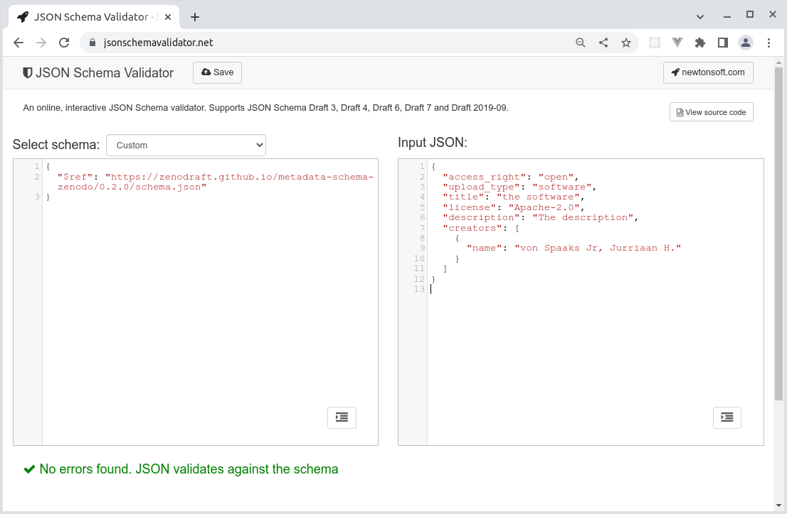

# How FAIR is your software? Introduction and Tutorial

## Tentative schedule

| duration    | cumulative | description                  | session type |
| ---         | ---        | ---                          | ---          |
| 15m         | 15m        | fair-software.nl, FAIR       | presentation |
| 10m         | 25m        | howfairis                    | demo         |
| 30m         | 55m        | ~                            | hands on     |
| 10m         | 1h05m      | **break**                    | &nbsp;       |
| 15m         | 1h20m      | fair-software GitHub Action  | demo         |
| 20m         | 1h40m      | ~                            | hands on     |
| 10m         | 1h50m      | fairtally                    | demo         |
| 15m         | 2h05m      | ~                            | hands on     |
| 10m         | 2h15m      | **break**                    | &nbsp;       |
| 45m         | 3h         | extras                       | hands on     |

## 1. Preparation

**Prerequisites**

1. Have working internet connection
1. Have a GitHub account

**This section in brief**

1. Install Python, pip
1. Make virtual environment

**Note for Windows users only**

This tutorial makes extensive use of the command line. If you're on Windows, we recommend you install "Git Bash" from the "Git for Windows" package. You can download it from here: https://gitforwindows.org/. Git Bash will allow you to run terminal emulator commands just like you would on Linux/Mac systems. Additionally, all the tools we'll be using in this tutorial are installable via the third-party package manager for Windows named [Chocolatey](https://chocolatey.org/) or `choco` for short. You can install `choco` following the instructions from https://community.chocolatey.org/courses/installation/installing?method=installing-chocolatey#cmd. The dropdown list at the top of that page also offers alternative ways of installing `choco`.

**Action required (&#9733;)**

Throughout this tutorial, you'll encounter the &#9733; symbol; this indicates that you have to take some kind of action which is described in the text immediately following the symbol. Of course, you are welcome to experiment with running additional commands as you work through these materials. Let yourself be guided by your curiosity!

### Install Python, `pip`

&#9733; Before we begin, we have to make sure that we have the necessary tools installed. Depending on how your specific system has been set up, run

```shell
python3 --version
```

Make sure that the version number you're getting is 3.7 or higher. If you don't have Python yet, install from your operating system's repositories (Mac/Linux), using `choco` (Windows), or download and install Python from https://www.python.org/downloads/.

&#9733; Next, we need `pip` as well. Check if you have `pip` by:

```shell
python3 -m pip --version
```

For Windows and Mac (if you installed Python via `homebrew`), you should already have `pip` if you have Python. For Linux, you may need to install `pip` separately:

```shell
# Ubuntu-like systems
sudo apt update
sudo apt install python3-pip

# Fedora
sudo dnf install python3-pip
```

Finally, we'll also be using virtual environments, this may require additional packages to be installed if you're on Linux/Mac:

```shell
# Ubuntu-like systems
sudo apt install python3-venv
```

For more information on installing Python and `pip`, visit

1. https://packaging.python.org/en/latest/tutorials/installing-packages/
1. https://packaging.python.org/en/latest/guides/installing-using-linux-tools/

### Virtual environment

For this tutorial, we will be installing `howfairis` and `fairtally` as well as their dependencies on to your system. To make sure we minimize interfering with your system, we'll be working in a so-called virtual environment. This way, we can avoid having to deal with (versions of) dependencies not playing nice with whatever else is on your system already.

&#9733; Create a virtual environment using `venv`, the standard tool for doing just that:

```shell
cd <to where you want the files for this tutorial to be>
python3 -m venv env
```

&#9733; The previous command should have created a new directory by the name `env` (or whatever you entered as the argument to `venv`). We just have to activate it, as follows:

```shell
source ./env/bin/activate
```

Depending on your system setup, the command line prompt will reflect that we are now using the virtual environment. You can also tell by asking the system about the `python3` it knows about, like so:

```shell
which python3
```

This should return a `python` that is local to the `env` directory, most likely `./env/bin/python`.

## 2. howfairis

**This section in brief**

1. Install `howfairis` from PyPI
1. Run `howfairis` on a GitHub repository
1. Explore the command line options
1. Experiment with `howfairis` configuration file on local and on remote

The tool that we will be using in this part is called `howfairis`. It is a command line program that you can install from the Python Package Index (PyPI). PyPI is the Python community's platform where people publish their packages, so that others can use them. You can see the page for the `howfairis` package on PyPI here https://pypi.org/project/howfairis.

&#9733; With the virtual environment active, download and install `howfairis` from PyPI using:

```shell
python3 -m pip install howfairis
```

&#9733; You should now have access to the `howfairis` command line program. Verify that it worked by having `howfairis` print its version, like so:

```shell
howfairis --version
```

(mine says: `version: 0.14.2`).

Printing help info works in the usual way:

```shell
howfairis --help
```

If you didn't get any error messages during the `pip install` step, but can't access the command line program, you may have to update your `PATH` environment variable, or use absolute paths to point to the command line program.

Updating your `PATH` can be done as follows:

```shell
# prepend the $PATH with the absolute path to the env's bin directory
PATH=$PWD/env/bin:$PATH
```

Using `howfairis` with absolute paths can be done like this:

```shell
./env/bin/howfairis --version
```

&#9733; Next, create a new repository on GitHub for the experiments we'll be doing in this tutorial. Make sure to check the "Add a README file" checkbox when asked, and verify that the repository visibility is set to "Public", otherwise the tooling won't be able to see you repository.

Our README is written in MarkDown, but note that `howfairis` also supports `README`s written in ReStructured Text. Besides repositories on GitHub, `howfairis` supports GitLab repositories as well, albeit with some limitations: at the moment, `howfairis` can only handle repositories on gitlab.com (i.e. not on self-hosted instances), and only repositories that do not use GitLab's subgroup feature.

&#9733; From your terminal, run `howfairis` on the newly created repository, as follows:

```shell
# e.g. I created a dummy repository "ieee-test-repo" under my GitHub user account "jspaaks"
howfairis https://github.com/jspaaks/ieee-test-repo
```

This should print something along the lines of the following:

```text
Checking compliance with fair-software.eu...
url: https://github.com/jspaaks/ieee-test-repo
(1/5) repository
      ✓ has_open_repository
(2/5) license
      × has_license
(3/5) registry
      × has_ascl_badge
      × has_bintray_badge
      × has_conda_badge
      × has_cran_badge
      × has_crates_badge
      × has_maven_badge
      × has_npm_badge
      × has_pypi_badge
      × has_rsd_badge
      × is_on_github_marketplace
(4/5) citation
      × has_citation_file
      × has_citationcff_file
      × has_codemeta_file
      × has_zenodo_badge
      × has_zenodo_metadata_file
(5/5) checklist
      × has_core_infrastructures_badge

Calculated compliance: ● ○ ○ ○ ○

It seems you have not yet added the fair-software.eu badge to
your README.md. You can do so by pasting the following snippet:

[](https://fair-software.eu)
Warning: Your README.md was updated less than 5 minutes ago. T
he effects of this update are not visible yet in the calculate
d compliance.
```

The output breaks down as follows:

1. First, `howfairis` prints which URL it's checking;
1. Then there is the list of checks it performed with either a checkmark, or a cross. The checks are divided over the 5 categories from fair-software.eu. If at least one check in each category is valid, then the repository is considered to be compliant for that category;
1. The calculated compliance is printed to the terminal. In the output above, only the first category is compliant, because we made sure our repository is publicly accessible.
1. The tool checks whether your `README.md` contains the expected badge, and will print a message if it can't find it. The same message also gets printed if the badge is different from what the tool expects;
1. Finally, be aware that GitHub uses server-side caching for performance reasons, which means that `howfairis` is sometimes looking at a slightly older README file than what you yourself see online. If this happens, `howfairis` will print a warning in the terminal. The easiest way to fix this is to simply wait a couple of minutes after you make relevant changes to your `README.md` (The rest of the repo's file are not used for the analysis).

&#9733; Update your `README.md` with the suggested badge. While you wait for the GitHub servers to expire the cache, take a look at adding a license below.

So far we have not added a license to the repository. Since the author of the software is automatically protected by copyright, that means nobody can (legally) copy your repository at the moment. From a legal point of view, that means others are not allowed to even `git clone` the repository. Now, if your files are on GitHub and in a public repository, this is probably not your intent. It is therefore good practice to add a license, so that others may make copies, while protecting you against liability if it may come to that.

&#9733; On GitHub, use the "Add file" button, then "Create new file". In the field that says "Name your file", type "LICENSE" (capitalized by tradition). When you do this, a new button "Choose a license template" will appear in the top right. Click it, pick a license, then click "Review and submit". Commit to the `main` branch. For the purposes of the tutorial, it doesn't matter which license you pick.

&#9733; Five minutes should have passed while you were working on adding a license to the repository, now re-run `howfairis`. The result should have changed; update the README accordingly.

Although `howfairis` already includes a variety of tests, there will always be cases not covered by the tool. For example, the GitHub interface only allows for one license, while some software packages are dual licensed. Or, maybe your software is published in a community registry that isn't recognized. For this reason, `howfairis` allows you to overrule each category using a configuration file, by default named `.howfairis.yml`.

&#9733; Create a local copy of the default `.howfairis.yml` file by running `howfairis` with the `-d` ("print default configuration") flag and storing its output in a new file named `.howfairis.yml`:

```shell
# print default configuration
howfairis -d  

# pipe the output to a file (or copy-paste)
howfairis -d > .howfairis.yml
```
&#9733; Now use your favorite plain text editor to edit the configuration file. Uncomment one of the 5 `skip_****_checks_reason` lines, and make up a reason.

&#9733; To test, you need to tell `howfairis` to use the configuration file we just made, using the `-u` optional argument:

```shell
howfairis -u .howfairis.yml https://github.com/jspaaks/ieee-test-repo
```

The output should now reflect the reason you gave, e.g.:

```text
Checking compliance with fair-software.eu...
url: https://github.com/jspaaks/ieee-test-repo
Local configuration file: .howfairis.yml
(1/5) repository
      ✓ has_open_repository
(2/5) license
      ✓ has_license
(3/5) registry
      × has_ascl_badge
      × has_bintray_badge
      × has_conda_badge
      × has_cran_badge
      × has_crates_badge
      × has_maven_badge
      × has_npm_badge
      × has_pypi_badge
      × has_rsd_badge
      × is_on_github_marketplace
(4/5) citation
      × has_citation_file
      × has_citationcff_file
      × has_codemeta_file
      × has_zenodo_badge
      × has_zenodo_metadata_file
(5/5) checklist
      ✓ skipped (reason: i'm using codacy)

Calculated compliance: ● ● ○ ○ ●

Congratulations! The compliance of your repository exceeds the
 current fair-software.eu badge in your README.md. You can rep
lace it with the following snippet:

[](https://fair-software.eu)
```

Great! So now you know how to customize the results to fit your needs by using a local configuration file. However, to make sure everybody gets to see the same results, we need to make the configuration file part of the repository.

&#9733; Add the configuration file to the repository, either using the command line:

```shell
git add .howfairis.yml
git commit -m "added howfairis exception via config file"
git push origin main
```

Or by using GitHub's interface:

1. Click button "Add File" > "Create new file";
1. Name the file `.howfairis.yml` (it has to be exactly that, including the leading dot)
1. Then copy-paste the contents from your terminal into it;
1. When you're ready, click the green button "Commit to new file" at the bottom.

&#9733; Now all that's left to do is to verify that the configuration gets picked up when we re-run `howfairis` without the `-u` parameter:

```shell
howfairis https://github.com/jspaaks/ieee-test-repo
```

The output should include your reason for skipping.

## 3. fair-software GitHub action

**This section in brief**

1. GitHub Actions: workflow files, triggers
1. GitHub Actions Marketplace
1. Setting up continuous monitoring of fair-software badge

In the previous section, you used `howfairis` to run an analysis from your local machine. This is great for general purpose use, and while you are still debugging, but it would be convenient to be able to automatically re-run the howfairis analysis, maybe once every few days or so. The `fair-software` GitHub Action that is available from GitHub Marketplace (https://github.com/marketplace/actions/fair-software) uses `howfairis` to do exactly that.

&#9733; Use github.com's graphical user interface to create a new file `.github/workflows/fair-software.yml`. You can use a different filename if you like, but the path must be exactly like it is here (including the leading dot in `.github`). Copy the workflow file below into the newly created file.

```yaml
name: fair-software

on:
  workflow_dispatch:
  schedule:
    # every 5 days at 03:00, see https://crontab.guru
    - cron: '0 3 */5 * *'

jobs:
  verify:
    runs-on: ubuntu-latest
    steps:
      - uses: fair-software/howfairis-github-action@0.2.1
        with:
          MY_REPO_URL: "https://github.com/${{ github.repository }}"
```

Besides `name`, the workflow file above has two other properties defined at the top level: `on` and `jobs`. `on` is used to specify what events can trigger the workflow. Here, we're using two events `workflow_dispatch` and `schedule`. `workflow_dispatch` lets the user start the workflow by hand via a button on GitHub.com, while `schedule` will start the workflow's jobs based on a schedule defined by the `cron` job parameters. See Cron's wiki page [here](https://en.wikipedia.org/wiki/Cron) or [https://crontab.guru](https://crontab.guru/#0_3_*/5_*_*) for a human readable interpretation of the `cron` string.

The second property defined at the top level is `jobs`, this is essentially a list of tasks that the workflow will execute when triggered. It defines the operating system to run on (here: Linux Ubuntu, but there are also options for Mac and Windows). Our workflow has just one step, and `uses` a pre-existing GitHub Action that is available from the GitHub Marketplace (`fair-software/howfairis-github-action`). Such GitHub Actions are identified by the GitHub organization and repository where they are maintained, followed by an identifier for the version. Workflow files can have more than one step. For more information on GitHub Actions, please refer to the documentation: https://docs.github.com/en/actions.

When writing workflow files, it is sometimes useful to use a linter for YAML files (workflows are written in YAML). One such linter is http://www.yamllint.com/. Just copy paste your code in there and click the button labeled "Go".

&#9733; Navigate to your repo's Actions tab. There, you should see the fair-software workflow listed on the left:



&#9733; Click on the fair-software workflow, the content on the right should now show a button "Run workflow" (see image below). Click it, let branch be the `main` branch, and click the green "Run workflow" button. It takes a few seconds before you get any visual feedback, but then you'll see the interface change to something like this:



The Action's result is green if and only if the `howfairis` analysis yields exactly the badge that `howfairis` expected. Any difference between the calculated compliance and what the README suggests will result in an error. This can be a bit confusing sometimes, because an improvement in calculated compliance can show up as an error if the fair-software badge in the README is still showing the previous compliance.

&#9733; If your Action status is red, make the necessary changes to make it green again. Refer to the Action's log for easy copy-paste.

&#9733; Update your README with the status badge for the GitHub Action by Navigating to the log of the workflow, then clicking the ellipsis button in the top right corner, then click the button "Copy status badge Markdown":



The README should now look more or less like the image below depending on which categories you chose to skip in the previous section:



## 4. fairtally

**This section in brief**

1. Install `fairtally`
1. Create a list of repositories
1. Get access token for relevant platforms
1. Run `fairtally`
1. Inspect `fairtally` results

In this part, we'll use an second tool that is installable from PyPI. The tool is called `fairtally`, and is designed to be a wrapper around `howfairis`. It facilitates iterating over a list of repositories, running the `howfairis` analysis for each one, and collating the results into an interactive Web App.

&#9733; Install `fairtally` into the virtual environment you created previously by:

```shell
python3 -m pip install fairtally
```

Next we need to make a list of repository URLs.

&#9733; Use your favorite plain text editor to make a new file `urls.txt`. This file will contain the list of repositories, but for now just copy paste your repo URL into it.

&#9733; Run fairtally on the list:

```shell
fairtally -i urls.txt
```

If successful, it should check the repository and print a message about where to find the results.

&#9733; Open the results file `tally.html` in your browser. It should look like the image below:



The report shows a list of repositories, along with a breakdown of the compliance and the resulting badge. The rows can be sorted for convenience, although that's not useful yet since we have just one repository. Also, the search bar near the top right of the page lets you filter the list of repositories by (part of) the URL.

Before we can run `fairtally` on a longer list of URLs, we need to make sure that the GitHub API will not start denying the requests that `howfairis` is making on our behalf (such denials are known as ["429 Too Many Requests"](https://developer.mozilla.org/en-US/docs/Web/HTTP/Status/429) errors). To avoid 429 errors, it helps if you identify yourself when you're making a request to the GitHub API. You can do so by using a so-called Personal Access Token.

&#9733; Go to https://github.com/settings/tokens and click "Generate new token". For "note", fill in something that describes your usage of the token, something like "Querying the GitHub API". Choose whichever expiration duration works for you. You don't need to select any scope, since our token will not any need special permissions, it will just read public data. Scroll down and click "generate token". Make sure to copy the token now, GitHub will show its value only once.

&#9733; In your terminal, make a new environment variable `APIKEY_GITHUB` and make sure to `export` its value, as follows:

```shell
export APIKEY_GITHUB=<your github username>:<the token value>
```

&#9733; Great! Now let's try running `fairtally` on a longer list of URLs. You can make your own, or use the code snippet below, or use the list below:

```shell
# More information on GitHub API here:
# https://docs.github.com/en/rest/repos/repos#list-organization-repositories

YOUR_ORG=citation-file-format

curl -s -H "Accept: application/vnd.github+json" \
"https://api.github.com/orgs/${YOUR_ORG}/repos?per_page=100&page=0&sort=pushed" | \
jq -r '.[] .html_url' > urls.txt
```
```shell
https://github.com/citation-file-format/citation-file-format
https://github.com/citation-file-format/cff-converter-python
https://github.com/citation-file-format/cff-initializer-javascript
https://github.com/citation-file-format/citation-file-format.github.io
https://github.com/citation-file-format/cff-initializer-javascript-v1
https://github.com/citation-file-format/ruby-cff
https://github.com/citation-file-format/cffconvert-github-action
https://github.com/citation-file-format/doi2cff
https://github.com/citation-file-format/branding
https://github.com/citation-file-format/get-spdx-licenses
https://github.com/citation-file-format/pycff
https://github.com/citation-file-format/schema
https://github.com/citation-file-format/cff-reader-java
https://github.com/citation-file-format/citeme
https://github.com/citation-file-format/citemycode
https://github.com/citation-file-format/github2cff
https://github.com/citation-file-format/soccs
```

&#9733; Make sure you have your Personal Access Token available as an environment variable in your terminal, then run `fairtally` with the URL list:

```
fairtally -i urls.txt
```

&#9733; Once it finishes, open the generated `tally.html` file in your browser to inspect the results. It should look more or less like this:



## 5. Where to go from here

At this point in the tutorial, you know how to generate a `howfairis` report on your own repo, how to monitor the status automatically using the fair-software GitHub Action, and even how to make an overview of the compliance status given a list of repositories.

However, you may have found that the compliance score for your repos could still be improved. That's why the next sections cover various resources, tools, and workflows that can help you work on some of those aspects. You can pick and choose whichever subject you think is most interesting to you. Note that some sections assume knowledge of other sections; when this is the case, this is indicated at the top of the section as "Prerequisites".

For convenience, use the list below to navigate to each section:

- [GitHub-Zenodo integration](#extras-github-zenodo-integration)
- [Creating a CITATION.cff file](#extras-creating-a-citationcff-file)
- [Creating depositions on Zenodo with `zenodraft` CLI](#extras-creating-depositions-on-zenodo-with-zenodraft-cli)
- [Checklist for FAIR research software](#extras-checklist-for-fair-research-software)
- [Research Software Registries](#extras-research-software-registries)

## Extras: GitHub-Zenodo integration

To ensure long-term accessibility of your software, it's useful to store snapshots of your releases to an archiving platform such as [Zenodo](https://zenodo.org). Zenodo will keep a copy of a particular snapshot, and mint a persistent identifier (more specifically, a DOI) for it as well. This is useful for you and others who want to reference the exact version of your software, for example when using it for a paper. While you can upload your software by hand every time you make a release, it's convenient and less error-prone to automate the process such that Zenodo will store a snapshot every time you publish a release on GitHub. One way to set this up is to use the GitHub-Zenodo integration.

CodeRefinery has an excellent guide that will walk you through the necessary steps [1]. You can find it here: https://coderefinery.github.io/github-without-command-line/doi/.

&#9733; Use the CodeRefinery tutorial to set up the GitHub-Zenodo integration for an example repository.

If you're setting up the integration for a GitHub organization (as opposed to your own user account), you may need to use the GitHub settings page to enable the OAuth app that makes Zenodo and GitHub work together. There are separate OAuth apps for Zenodo Sandbox and for Zenodo. You can find direct links to each below:

- Zenodo Sandbox: https://github.com/settings/connections/applications/64a3663a0ac1183598ce
- Zenodo: https://github.com/settings/connections/applications/c04ff9cf27ed8474bc1c

There, you will find a list of GitHub organizations that you're an Admin for. Next to each organization, there will be a "Grant" button (see picture below) to allow the OAuth app to communicate with Zenodo / Zenodo Sandbox or your behalf. For organizations where you don't have enough permissions, there will be a "Request" button, to notify the organization administrators.



### References

1. Bast, R., Darst, R., Lenk, K. (2022) _Collaborating and sharing using GitHub without command line_, GitHub, https://github.com/coderefinery/github-without-command-line/tree/3a067788f1054f4816bf30d552ff40af64b33c78

## Extras: Creating a CITATION.cff file

The Citation File Format [1] enables research software developers to include citation metadata with their software in a way that is readable by both humans and machines. The idea for the format was first proposed back in 2017 during [WSSSPE5.1](https://wssspe.researchcomputing.org.uk/wssspe5-1/) and since then has seen a quick uptake across various relevant players in the research software space. Notably, GitHub now supports the format and will render a "How to cite this repo" widget if your repository includes a `CITATION.cff` file:



Additionally, Zenodo will use metadata from a `CITATION.cff` file while ingesting a snapshot for archiving when used in combination with the GitHub-Zenodo integration.

While you can write a `CITATION.cff` file by hand with just a text editor and a copy of the [_Guide to Citation File Format schema_](https://github.com/citation-file-format/citation-file-format/blob/1.2.0/schema-guide.md), it is recommended to use the cffinit website: https://bit.ly/cffinit [2]. The website will help you write a valid `CITATION.cff.`

&#9733; Use the cffinit website to generate a `CITATION.cff` file for your software, then upload it to your tutorial repository on GitHub. Verify that the GitHub interface now shows a "Cite this repository" widget.

&#9733; Adding a `CITATION.cff` affects the status of the fair-software badge. Use the manual dispatch trigger on GitHub's Actions tab to start the fair-software workflow. It should finish with an error; refer to the fair-software action's log output to learn how to make the action green again.

&#9733; If you have the GitHub-Zenodo integration enabled for this repository (see previous section), try making a release and see what metadata from `CITATION.cff` is used to enrich the corresponding record on Zenodo Sandbox.

### References

1. Druskat, S., Spaaks, J.H., Chue Hong, N., Haines, R., Baker, J., Bliven, S., Willighagen, E., Pérez-Suárez, D. and Konovalov, A. (2021) _Citation File Format_, Zenodo, doi: 10.5281/zenodo.5171937
1. Spaaks, J.H., Verhoeven, S., Diblen, F., Druskat, S., Soares Siqueira, A., Garcia Gonzalez, J. and Cushing, R. (2022) _cffinit_, Zenodo, doi: 10.5281/zenodo.7032322

## Extras: Creating depositions on Zenodo with `zenodraft` CLI

**This section in brief**

1. download and install Node and NPM
1. download and install `zenodraft` from https://npmjs.com
1. get access tokens for Zenodo Sandbox
1. use `zenodraft` to publish a local file to Zenodo Sandbox
1. use `zenodraft` to attach metadata to the new deposition on Zenodo Sandbox

**Prerequisites**

1. Section above on Citation File Format
1. Basic familiarity with Zenodo

In this section, you'll use a command line tool called `zenodraft` which is available from `https://npmjs.com` to upload a file from your local machine to the archiving website [Zenodo](https://zenodo.org). Since we're only exploring at the moment, this tutorial uses the Zenodo Sandbox environment instead of regular Zenodo. The `zenodraft` commands work the same for either target platform, just make sure to leave out the `--sandbox` flag.

<!-- TODO zenodraft add instructions for installing Node and npm via nvm and nvs, with link to nodejs.org -->

&#9733; In order to let `zenodraft` upload items to Zenodo Sandbox, you are required to identify yourself using a Personal Access Token. To get the token, go to https://sandbox.zenodo.org/account/settings/applications/ and click "new token". For "Name", fill in something like "Token for zenodraft". Mark the `deposit:actions` and `deposit:upload` scopes as checked, then click "Create". Zenodo will show you the value of the token, make sure you copy it now, you won't be able to see it again later.

&#9733; When uploading a file to Zenodo, `zenodraft` will look for an environment variable by the name of `ZENODO_SANDBOX_ACCESS_TOKEN` that should contain the token. Set the environment variable, as follows:

```shell
export ZENODO_SANDBOX_ACCESS_TOKEN=<your-zenodo-sandbox-token>
```

&#9733; Run the command below to create an empty draft deposition in a new collection on Zenodo Sandbox. If successful, it will print the identifier for the first version in the new collection:

```shell
zenodraft deposition create concept --sandbox
```

<!-- TODO zenodraft explain concept / version -->

&#9733; Create a new environment variable named `VERSION_ID` and set it to the number that was printed:

```shell
VERSION_ID=1234567 # use your own number :)
```

&#9733; Point your browser to https://sandbox.zenodo.org and click "Upload" (button at the center top of the page; it may ask you to log in). After the jump, you should see a list of your depositions on Zenodo Sandbox. If everything worked, the top one is the one you just made. It should still be in unpublished/draft mode.

&#9733; On your local machine, create a new directory that will contain the files for this part. Create a new file. Just use some dummy file, but make sure it has some content otherwise Zenodo doesn't play nice.

```shell
# make some fake data
echo `date` > thefile.txt
```

Sidenote: the command above generates a file with different contents each time. This helps avoid problems with trying to upload a deposition whose files have the same hash as an existing deposition (Zenodo does not allow such duplication).

&#9733; Now upload the file to the newly created deposition:

```shell
zenodraft file add --sandbox $VERSION_ID thefile.txt
```

Currently the metadata for your draft deposition is probably looking a bit sparse. You could update the metadata by hand, using Zenodo's graphical user interface, but doing this for every software release might get a bit tedious so let's automate that. To do so, you can use dedicated metadata files which you can store with the other files in your repository. Here is an example of a minimal metadata file for Zenodo:

```json
{
  "access_right": "open",
  "upload_type": "software",
  "title": "The title",
  "license": "Apache-2.0",
  "description": "The description"
}
```

Zenodo metadata files are written in JSON. You can use [JSONLint](https://jsonlint.com) to make sure your JSON files are valid syntax.

&#9733; Create an empty file in your working directory named `.zenodo.minimal.json`. Copy the snippet above into it, then use `zenodraft` to attach the metadata to your draft deposition:

```shell
zenodraft metadata update --sandbox $VERSION_ID .zenodo.minimal.json
```

&#9733; Inspect the draft deposition on https://sandbox.zenodo.org, and if everything looks good, finalize it using:

```shell
zenodraft deposition publish --sandbox $VERSION_ID
```

Note that once you finalize a deposition, you can no longer update the files in the deposition (but the metadata can still be updated afterwards). Instead of the command line, you can also finalize a deposition by navigating to the Zenodo Sandbox interface and clicking the button there. This latter way can be especially useful because it gives you the opportunity to inspect the deposition before publishing it.

Afterwards, you should be able to see your published deposition on Zenodo Sandbox https://sandbox.zenodo.org/record/<your version id>.

While this is all great, the deposition's metadata does not currently include any of the citation information that we put in `CITATION.cff` (see previous section). It would be really nice if we can use those data without having to keep two files in sync. Luckily, this is possible by using a tool named `cffconvert`, available from [PyPI](https://pypi.org/project/cffconvert).

&#9733; Copy the `CITATION.cff` file (see previous section) into your working directory so it is next to `thefile.txt` and `.zenodo.minimal.json`.

&#9733; Verify your Python virtual environment is active, then install `cffconvert` from PyPI using:

```shell
python3 -m pip install cffconvert
```

`cffconvert` can validate `CITATION.cff` files, and can convert the data from your `CITATION.cff` into a variety of other formats.

&#9733; Make sure the `CITATION.cff` file is valid by using:

```shell
cffconvert --validate
```

You should see a message like:

```text
Citation metadata are valid according to schema version 1.2.0.
```

&#9733; Convert the citation metadata from your `CITATION.cff` to Zenodo metadata using:

```shell
cffconvert -f zenodo -o .zenodo.citation.json
```

This will generate a new file `.zenodo.citation.json` containing the Zenodo equivalent of your `CITATION.cff` data.

Now we need to merge `.zenodo.minimal.json` with `.zenodo.citation.json` to get the required metadata file. For this we can use `jq`, a program that helps you wrangle JSON files. For example, given two JSON files `a.json` and `b.json`:

```json
{
  "a": 3
}
```

```json
{
  "b": "hello"
}
```

we can use `jq` as follows to combine them:

```shell
cat a.json b.json | jq -s add
```

The result will be:

```json
{
  "a": 3,
  "b": "hello"
}
```

&#9733; Use `jq` to combine `.zenodo.minimal.json` with `.zenodo.citation.json` and use the result to update the metadata of your deposition (Zenodo allows updating metadata after finalizing the deposition), as follows:

```shell
cat .zenodo.minimal.json .zenodo.citation.json | jq -s add > .zenodo.json
zenodraft metadata update --sandbox $VERSION_ID .zenodo.json
```

&#9733; Inspect the record on Zenodo Sandbox and verify that the metadata was updated to reflect the data from `CITATION.cff`.

Zenodo supports a lot of metadata, but its documentation is a bit sparse at the moment. The _unofficial_ JSONschema for Zenodo deposition metadata is maintained here: https://github.com/zenodraft/metadata-schema-zenodo. You can use tools like JSONSchemaValidator (https://www.jsonschemavalidator.net/) to make sure the JSON follows the layout that Zenodo expects.

Online JSON schema validators usually have two text areas: the one on the left should contain the JSONschema that you want to test against. This can either be the JSONschema document itself, or a reference to such a document (`$ref` in JSONschema parlance). The text area on the right can then be used to write a JSON document that follows the schema. The image below shows what that looks like when using the published Zenodo metadata schema from https://zenodraft.github.io/metadata-schema-zenodo/0.2.0/schema.json (left side) to validate a simple Zenodo metadata file (right side).



&#9733; For a glimpse of what is possible, have a look at https://sandbox.zenodo.org/record/1049232, a dummy deposition where we tried to use all the supported properties. The `.zenodo.json` that was used to create that record is here: https://github.com/zenodraft/metadata-schema-zenodo/blob/0.2.0/README.md.

## Extras: Checklist for FAIR research software

**This section in brief**

1. Explore the interactive self-assessment FAIR checklist

The checklist we will use in this section is the result of a collaboration between Australian Research Data Council and Netherlands eScience Center. The questions in the checklist are based on discussions from the [FAIR4RS](https://www.rd-alliance.org/groups/fair-research-software-fair4rs-wg) initiative [1]. Although the checklist is already in a usable state, be aware that it is still a work in progress. In particular, the checklist is hosted at GitHub pages at the moment. Because GitHub Pages URLs are a bit unwieldy, it's likely that the URL will change. Be aware that this may break hyperlinks, which may mean that you have to redo any previous self assessments (which isn't a lot of work if you have no more than a handful of projects, but still).

The checklist is designed to be interactive, and yields a "FAIRness" badge that developers can put in their project's README file:

```MarkDown
[](https://ardc-fair-checklist.github.io/ardc-fair-checklist/#/software?v=0.1&f=000000&a=0000&i=00&r=000000)
```

The snippet above renders like this:

[](https://ardc-fair-checklist.github.io/ardc-fair-checklist/#/software?v=0.1&f=000000&a=0000&i=00&r=000000)

The advantage of this approach is that when visitors come to the project's README, they can restore the FAIRness self assessment state by clicking on the badge. This helps both with transparency and with metrics collection, while nudging researchers toward FAIRer practices.

&#9733; Go to https://ardc-fair-checklist.github.io/ardc-fair-checklist and see for yourself!

### References

1. Chue Hong, Neil P., Katz, Daniel S., Barker, Michelle, Lamprecht, Anna-Lena, Martinez, Carlos, Psomopoulos, Fotis E., Harrow, Jen, Castro, Leyla Jael, Gruenpeter, Morane, Martinez, Paula Andrea, Honeyman, Tom, Struck, Alexander, Lee, Allen, Loewe, Axel, van Werkhoven, Ben, Jones, Catherine, Garijo, Daniel, Plomp, Esther, Genova, Francoise, … RDA FAIR4RS WG. (2022). _FAIR Principles for Research Software (FAIR4RS Principles)_ (1.0). https://doi.org/10.15497/RDA00068

## Extras: Research Software Registries

**This section in brief**

1. Explore Research Software Registries

In order for software to be used by others, they need to be able to find it, and once found, visitors must be able to recognize that it will help them with whatever problem they are trying to solve. For this, it is really helpful if you publish your software in a software registry and provide a description and some metadata there. Such registries typically employ so-called Search Engine Optimization (SEO) techniques to tell search engines what each software package is about, so that they in turn can include the relevant links when people use their search portals.

There are many different types of research software registries, for example, they can be organized by programming language, by research domain, by organization, or even by country. The AwesomeList at https://bit.ly/awesome-registries provides an overview of such registries. 

&#9733; Have a look at the overview and consider publishing some of your software in a relevant repository.
