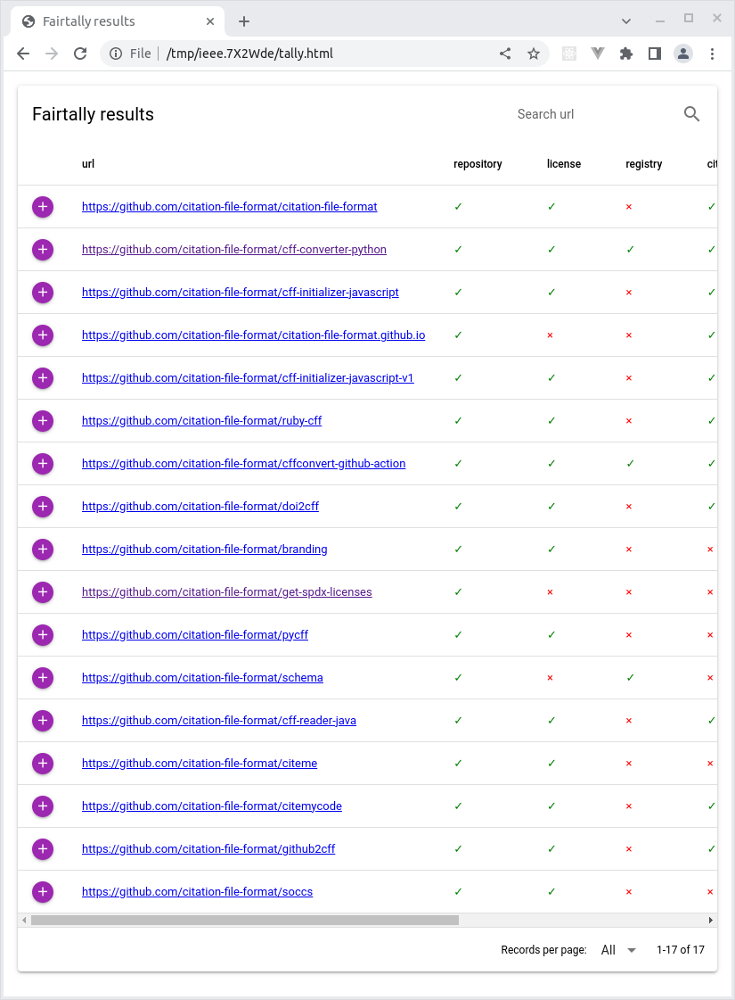
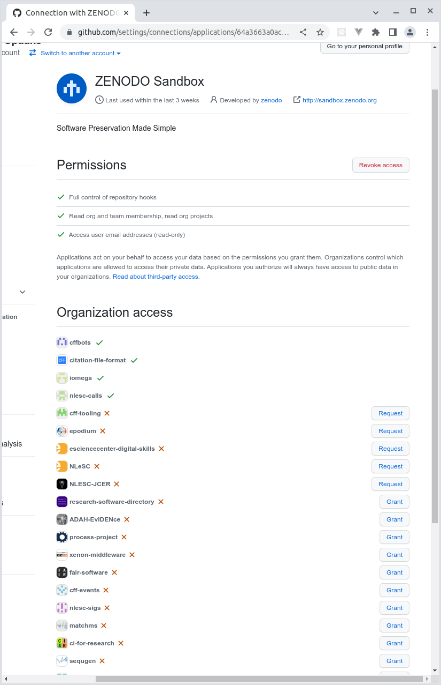

# How FAIR is your software? Introduction and Tutorial

## Tentative schedule

| duration    | cumulative | description                  | session type |
| ---         | ---        | ---                          | ---          |
| 15m         | 15m        | fair-software.nl, FAIR       | presentation |
| 10m         | 25m        | howfairis                    | demo         |
| 20m         | 45m        | ~                            | hands on     |
| 10m         | 55m        | howfairis config file        | demo         |
| 10m         | 1h05m      | **break**                    | &nbsp;       |
| 15m         | 1h20m      | fair-software GitHub Action  | demo         |
| 20m         | 1h40m      | ~                            | hands on     |
| 10m         | 1h50m      | fairtally                    | demo         |
| 15m         | 2h05m      | ~                            | hands on     |
| 10m         | 2h15m      | **break**                    | &nbsp;       |
| 45m         | 3h         | extras                       | hands on     |

## 1. Preparation

**This section in brief**

1. Install Python, pip
1. Make virtual environment

**Note for Windows users only**

This tutorial makes extensive use of the command line. If you're on Windows, we recommend you install "Git Bash" from the "Git for Windows" package. You can download it from here: https://gitforwindows.org/. Git Bash will allow you to run terminal emulator commands just like you would on Linux/Mac systems.

### Install Python, `pip`

Before we begin, we have to make sure that we have the necessary tools installed. Depending on how your specific system has been set up, run

```shell
python3 --version
```

Make sure that the version number you're getting is 3.7 or higher. If you don't have Python yet, install from your operating system's repositories, or download and install Python from https://www.python.org/downloads/.

Next, we need `pip` as well. Check if you have `pip` by:

```shell
python3 -m pip --version
```

For Windows and Mac (via `homebrew`), you should already have `pip` if you have Python. For Linux, you may need to install `pip` separately, e.g.:

```shell
# Ubuntu-like systems
sudo apt update
sudo apt install python3-venv python3-pip

# Fedora
sudo dnf install python3-pip python3-wheel
```

or

```shell
python3 -m ensurepip --default-pip
```

For more information on installing Python and `pip`, visit

1. https://packaging.python.org/en/latest/tutorials/installing-packages/
1. https://packaging.python.org/en/latest/guides/installing-using-linux-tools/

### Make virtual environment

For this tutorial, we will be installing `howfairis` and `fairtally` as well as their dependencies on to your system. To make sure we minimize interfering with your system, we'll be working in a so-called virtual environment. This way, we can avoid having to deal with (versions of) dependencies not playing nice with whatever else is on your system already.

Let's create a virtual environment using `venv`, the standard tool for doing just that:

```shell
cd <to where you want the files for this tutorial to be>
python3 -m venv env
```

This should create a new directory by the name `env` (or whatever you entered as the argument to `venv`). We just have to activate it, as follows:

```shell
source ./env/bin/activate
```

Depending on your system setup, the command line prompt will reflect that we are now using the virtual environment. You can also tell by asking the system about the `python3` it knows about, like so:

```shell
which python3
```

This should return a `python` that is local to the `env` directory, most likely `./env/bin/python`.

## 2. `howfairis`

**This section in brief**

1. Install `howfairis` from PyPI
1. Run `howfairis` on a repository of your choice
1. Explore the command line options
1. Experiment with `howfairis` configuration file
1. How to overrule a config file

The tool that we will be using in this part is called `howfairis`. It is a command line program that you can install from the Python Package Index (PyPI). PyPI is the Python community's platform where people publish their packages, so that others can use them. You can see the page for the `howfairis` package on PyPI here https://pypi.org/project/howfairis

With the virtual environment active, download and install `howfairis` from PyPI using:

```shell
python3 -m pip install howfairis
```

You should now have access to the `howfairis` command line program. Verify that it worked by having `howfairis` print its version, like so:

```shell
howfairis --version
```

(mine says: `version: 0.14.2`).

If you didn't get any error messages during the `pip install` step, but can't access the command line program, you may have to update your `PATH` environment variable, or use absolute paths to point to the command line program.

Updating your `PATH` can be done as follows:

```shell
# prepend the $PATH with the absolute path to the env's bin directory
PATH=$PWD/env/bin:$PATH
```

Using `howfairis` with absolute paths can be done like this:

```shell
./env/bin/howfairis --version
```

## 3. fair-software GitHub action

**This section in brief**

1. GitHub Actions: workflow files, triggers
1. GitHub Actions Marketplace
1. Set up continuous monitoring of fair-software badge

## 4. `fairtally`

**This section in brief**

1. Install `fairtally`
1. Create a list of repositories
1. Get access token for relevant platforms
1. Run `fairtally`
1. Inspect `fairtally` results

Example of how to get repository list from an organization (any other way is also fine):

```shell
YOUR_ORG=citation-file-format
curl -s -H "Accept: application/vnd.github+json" \
"https://api.github.com/orgs/${YOUR_ORG}/repos?per_page=100&page=0&sort=pushed" | \
jq -r '.[] .html_url' > urls.txt
```

(More information on GitHub API here: https://docs.github.com/en/rest/repos/repos#list-organization-repositories)

For the `citation-file-format` organization, that results in

```shell
cat urls.txt
```
```shell
https://github.com/citation-file-format/citation-file-format
https://github.com/citation-file-format/cff-converter-python
https://github.com/citation-file-format/cff-initializer-javascript
https://github.com/citation-file-format/citation-file-format.github.io
https://github.com/citation-file-format/cff-initializer-javascript-v1
https://github.com/citation-file-format/ruby-cff
https://github.com/citation-file-format/cffconvert-github-action
https://github.com/citation-file-format/doi2cff
https://github.com/citation-file-format/branding
https://github.com/citation-file-format/get-spdx-licenses
https://github.com/citation-file-format/pycff
https://github.com/citation-file-format/schema
https://github.com/citation-file-format/cff-reader-java
https://github.com/citation-file-format/citeme
https://github.com/citation-file-format/citemycode
https://github.com/citation-file-format/github2cff
https://github.com/citation-file-format/soccs
```

Make sure you have your GitHub/GitLab API access tokens as environment variables in your terminal, then run `fairtally` with the URL list:

```
fairtally -i urls.txt
```

Once it finishes, open the generated `tally.html` file in your browser to inspect the results. It should look more or less like this:



TODO describe this is the end of base contents, but there are Extras below

## 5. Extras: Citation File Format and its tooling

Tools and format together with Stephan Druskat (DLR, UBerlin, SSI), Arfon Smith (GitHub), Rob Haines (UManchester), and contributors.

- cffinit
- cffconvert

## 6. Extras: Drafting and publishing depositions on Zenodo with `zenodraft` CLI

**This section in brief**

1. download and install Node and NPM
1. download and install `zenodraft` from https://npmjs.com
1. get access tokens for Zenodo Sandbox
1. use `zenodraft` to publish a local file to Zenodo Sandbox
1. use `zenodraft` to attach metadata to the new deposition on Zenodo Sandbox

Since we're only exploring at the moment, this tutorial uses the Zenodo Sandbox environment instead of regular Zenodo. The `zenodraft` commands work the same for either target platform, just make sure to leave out the `--sandbox` flag, and don't forget you need separate tokens for each platform.

Before we get started, make sure you have the required programs:

```shell
# assert you have node and npm and zenodraft (after prerequisite sections)
node --version       # I'm on v16.15.0
npm --version        # I'm on 8.5.5
zenodraft --version  # I'm on 0.12.0
```

In order to use Zenodo Sandbox, you are required to identify yourself using a token. Get the token here https://sandbox.zenodo.org/account/settings/applications/. `zenodraft` will look for an environment variable by the name of `ZENODO_SANDBOX_ACCESS_TOKEN` whose value you should set to the value of your token.

```shell
# add tokens to terminal
export ZENODO_SANDBOX_ACCESS_TOKEN=<your-zenodo-sandbox-token>
```

Let's create an empty draft deposition in a new collection. If successful, it will return the identifier for the first version in the new collection, which is empty at the moment and still a draft / unpublished.

```shell
VERSION_ID=$(zenodraft deposition create concept --sandbox)
```

Now point your browser to https://sandbox.zenodo.org and click "Upload" (button at the center top of the page; may ask you to provide credentials). After the jump, you should see a list of your depositions on Zenodo Sandbox. If everything worked, the top one is the one you just made. It should still be in unpublished/draft mode.

Let's add a file to the draft deposition. Just use some dummy file, but make sure it has some content otherwise Zenodo doesn't play nice.

```shell
# make some fake data
echo 'some data' > thefile.txt
```

Now upload the file to the newly created deposition

```shell
zenodraft file add --sandbox $VERSION_ID thefile.txt
```

Next, let's add some metadata to the deposition. We can store this metadata in a local file, typically named `.zenodo.json`. 

```shell
# add the metadata using data from a metadata file
zenodraft metadata update --sandbox $VERSION_ID .zenodo.json
```

Zenodo supports a lot of metadata, but documentation is a bit sparse at the moment. The unofficial JSONschema for Zenodo depositions is available here: https://github.com/zenodraft/metadata-schema-zenodo. You can use tools such as JSONlint (https://jsonlint.com) to make sure the file you're writing is valid JSON, and tools like JSONSchemaValidator (https://www.jsonschemavalidator.net/) to make sure the JSON follows the layout that Zenodo expects.

For a glimpse of what is possible, have a look at https://sandbox.zenodo.org/record/1049232, a dummy deposition where we tried to use all the supported properties.

OK, we're almost near the end of this section. We just need to use `zenodraft` to finalize the deposition. Note that once you finalize a deposition, you can no longer update the files in the deposition themselves (but the metadata can still be updated afterwards). Also note that finalizing can also be done by navigating to the Zenodo Sandox interface and clicking the button there.

```shell
# Optionally finalize the deposition from this command line, or via Zenodo interface
zenodraft deposition publish --sandbox $VERSION_ID
```

## 7. Extras: Recommended workflow to publish on Zenodo with maximum metadata

Prerequisites:

- section above on Citation File Format
- section above on `zenodraft`
- GitHub Actions

**This section in brief**

1. Take a GitHub repo
1. Add a `CITATION.cff` file
1. Add the `zenodraft` GitHub action
1. Configure the workflow such that it will create a new version in an existing collection on Zenodo Sandbox each time a new release is published on GitHub.
1. Update the workflow file with a step to convert data from CITATION.cff to equivalent Zenodo JSON
1. Update the workflow file with a step to merge metadata from different sources into one file, which is then used when pushing the deposition to Zenodo Sandbox.

Problems with Zenodo-GitHub integration:

- when using CITATION.cff in your repo, minor ingestion errors (e.g. `name-particle`)
- CITATION.cff ingestion supports only small subset of what Zenodo metadata can do

In the current situation, one is forced to choose between good metadata rendering on GitHub citation widget, or good and extensive metadata on Zenodo. However, by combining `cffconvert`, `zenodraft`, GitHub actions, and `jq` (a command line JSON processor program), it's possible to have the best of both worlds. The rest of this section is dedicated to outlining the required workflow.

## 8. Extras: Checklist for FAIR research software

The checklist we will use in this section is the result of a collaboration between Australian Research Data Council and Netherlands eScience Center. The questions in the checklist are based on discussions from the [FAIR4RS](https://www.rd-alliance.org/groups/fair-research-software-fair4rs-wg) initiative. Although the checklist is already in a usable state, be aware that it is still a work in progress. In particular, the checklist is hosted at GitHub pages at the moment. Because GitHub Pages URLs are a bit unwieldy, it's likely that the URL will change. Be aware that this may break hyperlinks, which may mean that you have to redo any previous self assessments (which isn't a lot of work if you have no more than a handful of projects, but still).

The checklist is designed to be interactive, and yields a "FAIRness" badge that developers can put in their project's README file:

```MarkDown
[](https://ardc-fair-checklist.github.io/ardc-fair-checklist/#/software?v=0.1&f=000000&a=0000&i=00&r=000000)
```

The snippet above renders like this:

[](https://ardc-fair-checklist.github.io/ardc-fair-checklist/#/software?v=0.1&f=000000&a=0000&i=00&r=000000)

The advantage of this approach is that when visitors come to the project's README, they can restore the FAIRness self assessment state by clicking on the badge. This helps both with transparency and with metrics collection, while nudging researchers toward FAIRer practices.

Go to https://ardc-fair-checklist.github.io/ardc-fair-checklist and see for yourself!

## 9. Extras: Research Software Registries

In order for software to be used by others, they need to be able to find it, and once found, visitors must be able to recognize that it will help them with whatever problem they are trying to solve. For this, it is really helpful if you publish your software in a software registry and provide a description and some metadata there. Such registries typically employ so-called Search Engine Optimization (SEO) techniques to tell search engines what each software package is about, so that they in turn can include the relevant links when people use their search portals.

There are many different types of research software registries, for example, they can be organized by programming language, by research domain, by organization, or even by country. The AwesomeList at https://bit.ly/awesome-registries provides an overview of such registries. 

Have a look at the overview and consider publishing some of your software in a relevant repository.

## 10. Extras: GitHub-Zenodo integration

For long term accessibility of your software, it's useful to store snapshots of your releases to an archiving platform such as [Zenodo](https://zenodo.org). Zenodo will keep a copy of a particular snapshot, and mint a persistent identifier (more specifically, a DOI) for it as well. This is useful for you and others who want to reference the exact version of your software, for example when using it for a paper. While you can upload your software by hand every time you make a release, it's convenient and less error-prone to automate the process such that Zenodo will store a snapshot every time you publish a release on GitHub. One way to set this up is to use the GitHub-Zenodo integration.

CodeRefinery has an excellent guide that will walk you through the necesaary steps [1]. You can find it here: https://coderefinery.github.io/github-without-command-line/doi/.

If you're setting up the integration for a GitHub organization (as opposed to your own user account), you may need to use the GitHub settings page to enable the OAuth app that makes Zenodo and GitHub work together. There are separate OAuth apps for Zenodo Sandbox and for Zenodo. You can find direct links to each below:

- Zenodo Sandbox: https://github.com/settings/connections/applications/64a3663a0ac1183598ce
- Zenodo: https://github.com/settings/connections/applications/c04ff9cf27ed8474bc1c

There, you will find a list of GitHub organizations that you're an Admin for. Next to each organization, there will be a "Grant" button (see picture below) to allow the OAuth app to communicate with Zenodo / Zenodo Sandbox or your behalf. For organizations where you don't have enough permissions, there will be a "Request" button, to notify the organization administrators.



### References

1. Bast, R., Darst, R., Lenk, K. (2022) _Collaborating and sharing using GitHub without command line_, GitHub, https://github.com/coderefinery/github-without-command-line/tree/3a067788f1054f4816bf30d552ff40af64b33c78
